<p align="center">
    
</p>


<p align="center">

</p>

```bash


══════════════════════════════════════════════════════════════════════════════════════════════

   ██████╗██╗   ██╗██████╗ ███████╗██████╗  █████╗ ██╗ ██████╗ ███╗   ██╗██╗ ██████╗███████╗
  ██╔════╝╚██╗ ██╔╝██╔══██╗██╔════╝██╔══██╗██╔══██╗██║██╔═══██╗████╗  ██║██║██╔════╝██╔════╝
  ██║      ╚████╔╝ ██████╔╝█████╗  ██████╔╝███████║██║██║   ██║██╔██╗ ██║██║██║     ███████╗
  ██║       ╚██╔╝  ██╔══██╗██╔══╝  ██╔══██╗██╔══██║██║██║   ██║██║╚██╗██║██║██║     ╚════██║
  ╚██████╗   ██║   ██████╔╝███████╗██║  ██║██║  ██║██║╚██████╔╝██║ ╚████║██║╚██████╗███████║
   ╚═════╝   ╚═╝   ╚═════╝ ╚══════╝╚═╝  ╚═╝╚═╝  ╚═╝╚═╝ ╚═════╝ ╚═╝  ╚═══╝╚═╝ ╚═════╝╚══════╝

                   [ AI • CYBERSECURITY • RESEARCH ]

══════════════════════════════════════════════════════════════════════════════════════════════


```

# 👋 About Me

```cpp
while(alive){
    Learn();
    Build();
    Research();
}
```


I enjoy building AI systems,
post-quantum cryptography,
offensive security tools,
autonomous agents,
and multi swarm drones


<p align="center">

</p>


## ⚙️ Tech Stack

<p align="center">


</p>


## 📊 GitHub Stats

<p align="center">


</p>


<p align="center">


</p>


## 📈 Activity

[]()


## 🚀 Featured Projects

Coming Soon...


<a href="https://github.com/cyberaionics/LLM-From-Scratch">


</a>


## 🔬 Research Interests

- Large Language Models
- AI Agents
- Post Quantum Cryptography
- Reverse Engineering
- Malware Analysis
- eBPF
- Systems Programming


## 📝 Latest Articles

Coming Soon...


## 🏆 Achievements

<p align="center">


</p>


## 📫 Connect

<p align="center">

<a href="https://linkedin.com/in/atcysec">

</a>

<a href="mailto:ankush.tarafdar@gmail.com">

</a>

<a href="https://cyberaionics.github.io/website">

</a>

</p>